# Řešení – 3. hodina

Algoritmy jsou zapsané jako vývojové diagramy, tak jak bychom je sestavili v RAPTORu.

## Použité značky

| Tvar | RAPTOR | Význam |
|---|---|---|
| ovál | Start / End | začátek a konec programu |
| kosodélník nakloněný **doprava**, modrý | Input (GET) | načtení hodnoty od uživatele |
| kosodélník nakloněný **doleva**, červený | Output (PUT) | výpis na obrazovku |
| obdélník | Assignment | přiřazení do proměnné |
| kosočtverec | Selection | rozhodnutí, větve **Ano** / **Ne** |

Vstup a výstup se tedy rozlišují sklonem i barvou stejně jako v RAPTORu.
Malé šipky, které RAPTOR kreslí do boku těchto značek, se v Markdownu nakreslit nedají –
směr toku dat ale určuje hlavní šipka mezi značkami.

Šipka `←` znamená přiřazení (v C# `=`).
`mod` je zbytek po dělení (v C# `%`), `floor` je zaokrouhlení dolů (celočíselné dělení).

---

# Úloha 1

Uživatel zadá délku dvou stran obdélníku. Program vypočítá jeho obvod.

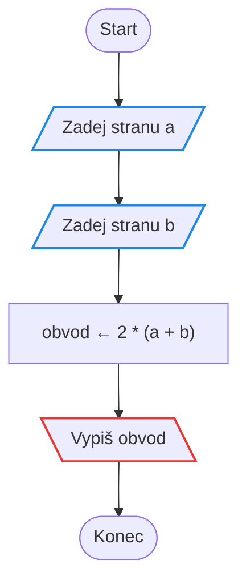

---

# Úloha 2

Uživatel zadá cenu nákupu. Pokud cena dosáhne alespoň 2 000 Kč, získá zákazník slevu 10 %.
Program zobrazí výslednou cenu.

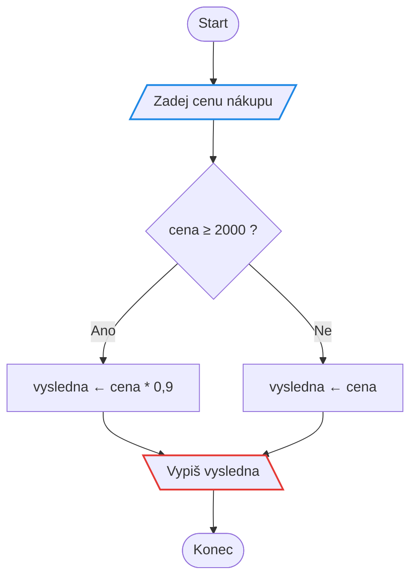

---

# Úloha 3

Uživatel zadá dvě čísla. Program zobrazí větší z nich.
Nezapomeň se zamyslet také nad případem, kdy jsou obě čísla stejná.

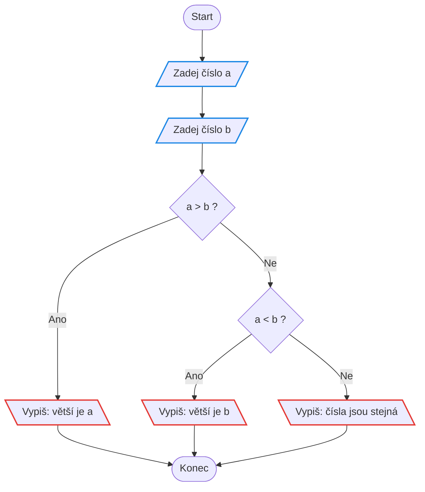

*Pozor: dvě podmínky za sebou, ne jedna. Kdyby byla jen `a > b`, případ rovnosti by spadl do větve „větší je b“.*

---

# Úloha 4

Uživatel zadá počet získaných bodů. Maximální počet je 100.
Pokud student získal alespoň 50 bodů, program zobrazí „Splnil“. V opačném případě „Nesplnil“.

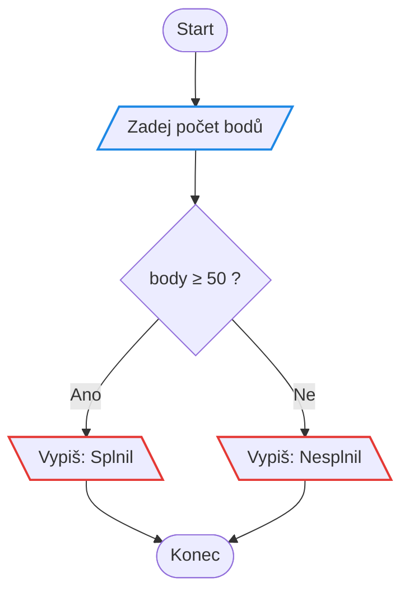

---

# Úloha 5

Uživatel má zadat číslo od 1 do 10. Pokud zadá hodnotu mimo tento interval,
program ho musí požádat o nové zadání. Opakování pokračuje tak dlouho,
dokud uživatel nezadá platnou hodnotu.

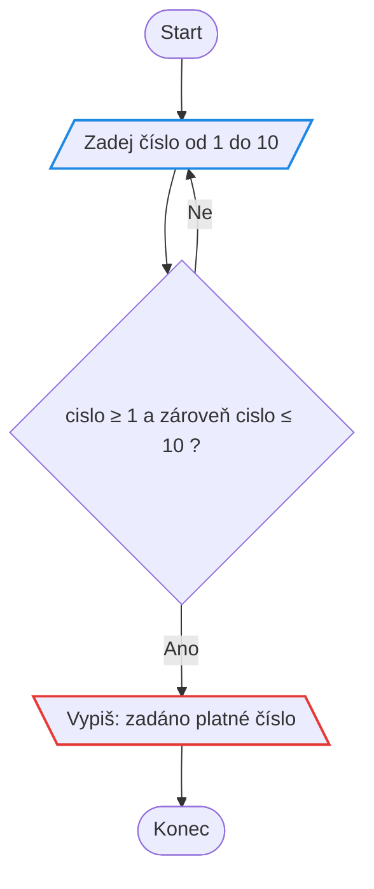

*Šipka zpět do načítání je celá smyčka. Všimni si, že se vrací na vstup, ne na začátek programu.*

---

# Úloha 6

Uživatel zadá teplotu ve stupních Celsia. Program ji převede na stupně Fahrenheita
a výsledek vypíše. Platí vztah F = C * 1,8 + 32.

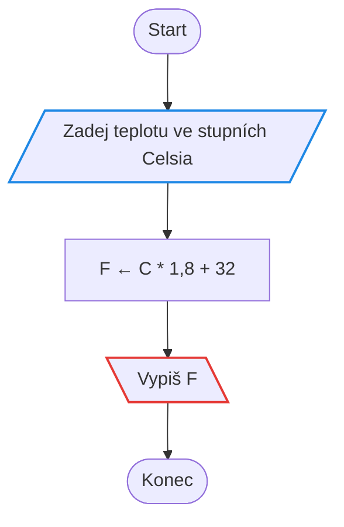

---

# Úloha 7

Uživatel zadá poloměr kruhu. Program vypočítá a vypíše jeho obvod a obsah.
Pro číslo pí použij Math.PI.

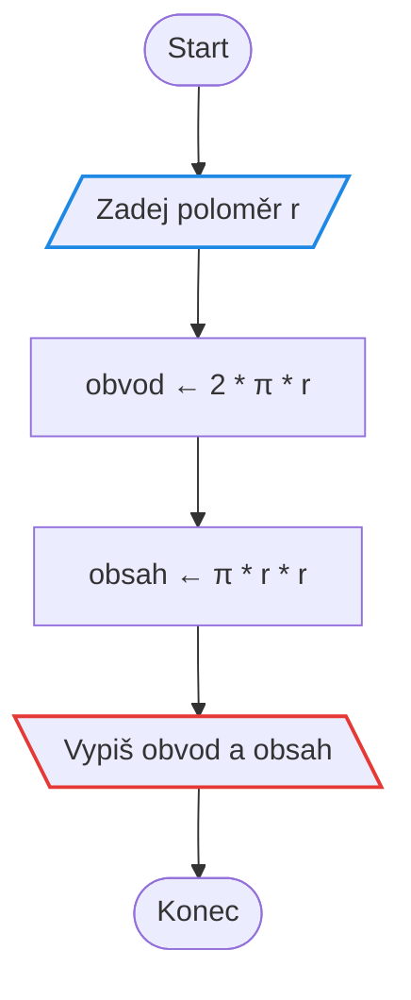

---

# Úloha 8

Uživatel zadá celé číslo. Program vypíše, zda je sudé, nebo liché.

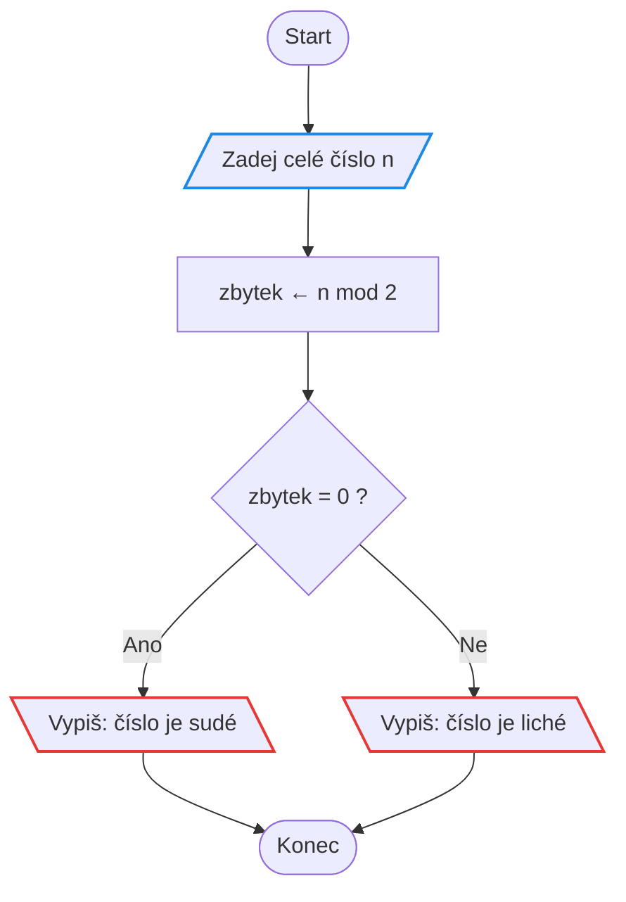

---

# Úloha 9

Uživatel zadá číslo. Program vypíše, jestli je kladné, záporné, nebo nula.

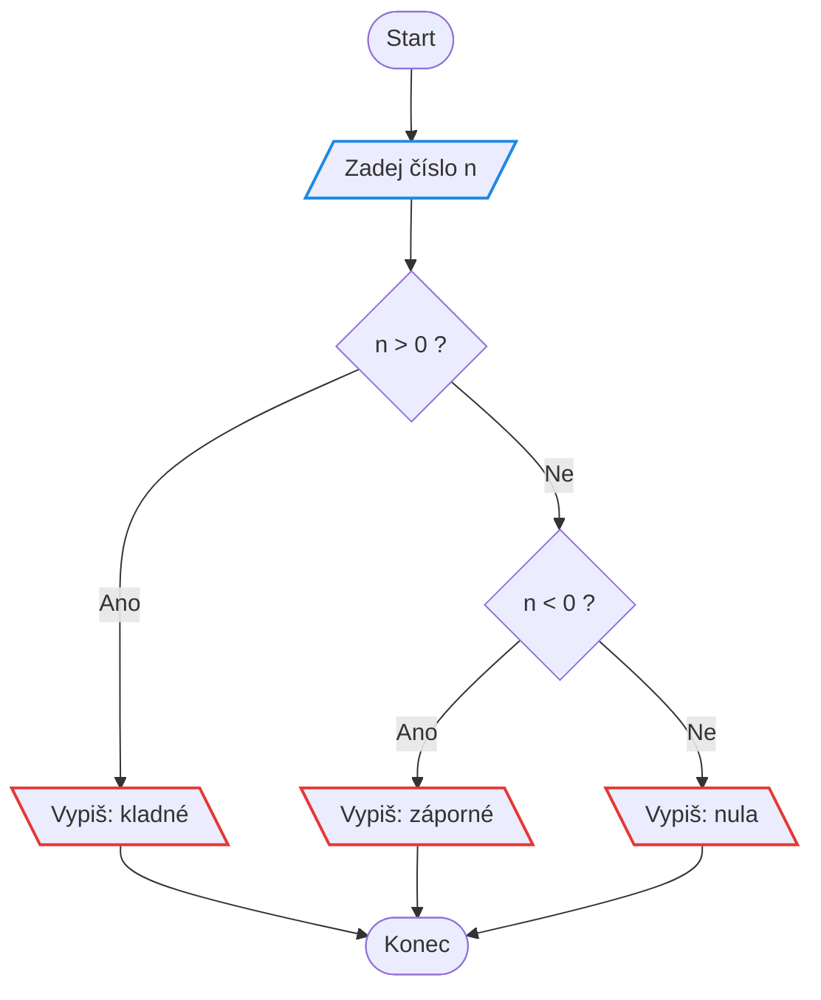

---

# Úloha 10

Uživatel zadá svůj věk a program vypíše cenu vstupenky do kina.
Základní vstupné je 180 Kč, ale děti do 15 let a lidé od 65 let platí polovinu.

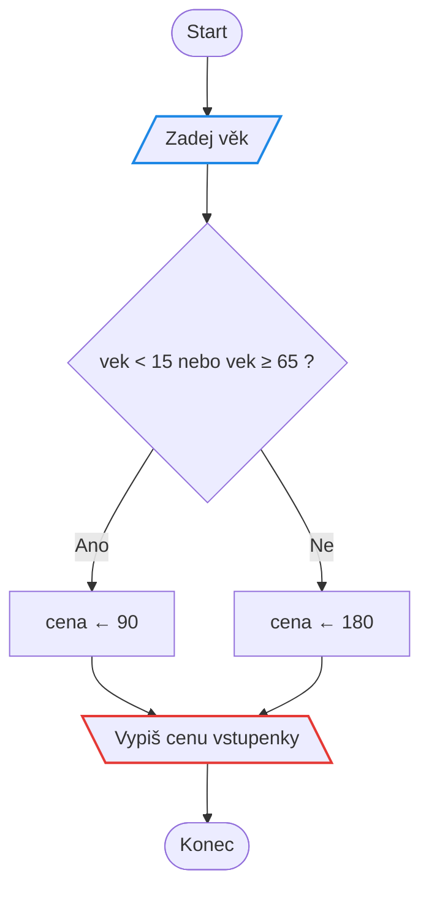

---

# Úloha 11

Uživatel zadá počet minut. Program ho převede na hodiny a minuty
a vypíše například ve tvaru „135 minut = 2 h 15 min“.

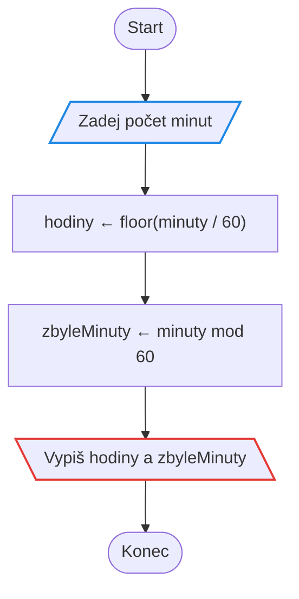

*Celočíselné dělení dá hodiny, zbytek po dělení minuty. V C# to `/` mezi dvěma `int` udělá samo.*

---

# Úloha 12

Uživatel zadá počet bodů z testu (maximum je 100). Program vypíše známku:
100–90 bodů je 1, 89–75 je 2, 74–60 je 3, 59–50 je 4 a méně než 50 je 5.

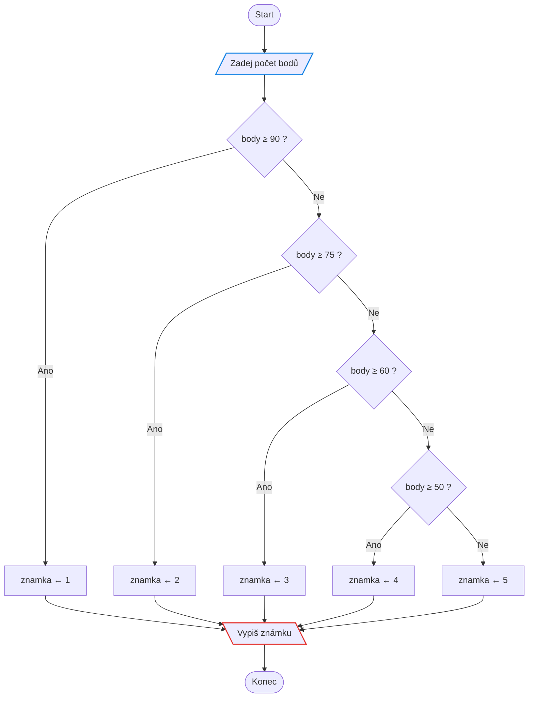

*Podmínky testujeme odshora dolů, proto stačí vždy jen dolní mez. Horní mez hlídá předchozí větev.*

---

# Úloha 13

Uživatel zadá tři čísla. Program vypíše největší z nich.
Opět si rozmysli, co se má stát, když jsou některá čísla stejná.

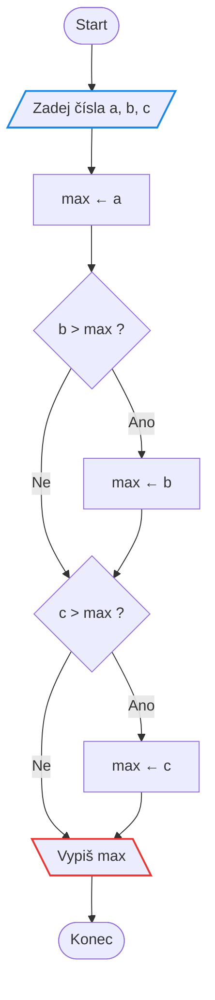

*Postup „zatím největší je a, zkus ho přebít“ je lepší než porovnávat všechny dvojice. Při rovnosti se max nepřepíše a vyjde správný výsledek.*

---

# Úloha 14

Uživatel má zadat svůj věk, tedy číslo od 0 do 120.
Pokud zadá hodnotu mimo tento rozsah, program ho požádá o nové zadání
a opakuje to tak dlouho, dokud nedostane platnou hodnotu.

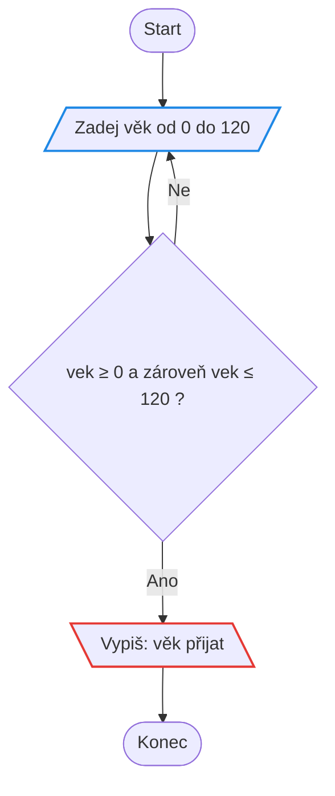

---

# Úloha 15

Uživatel postupně zadává čísla. Jakmile zadá 0, zadávání skončí
a program vypíše součet všech zadaných čísel.

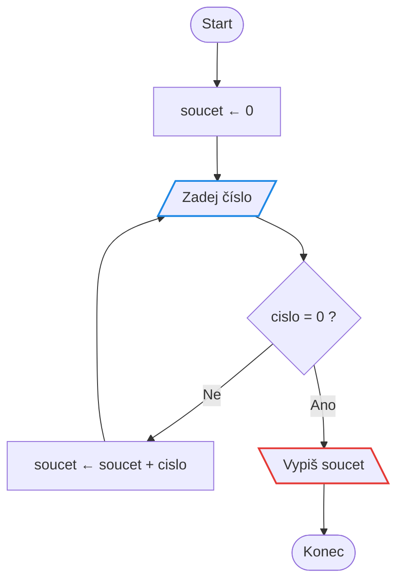

*Proměnná `soucet` se musí vynulovat **před** smyčkou. Kdyby byla uvnitř, vynulovala by se při každém průchodu.*
